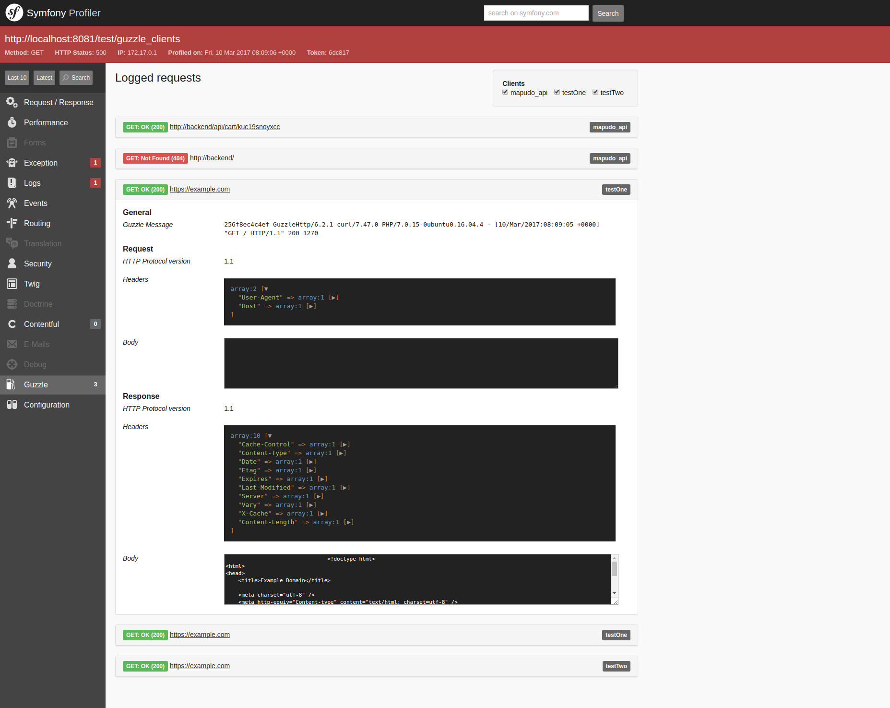

[![Latest Version on Packagist][ico-version]][link-packagist]
[![Software License][ico-license]](LICENSE.md)
[![Build Status][ico-travis]][link-travis]
[![Total Downloads][ico-downloads]][link-downloads]

**[Requirements](#requirements)** |
**[Install](#install)** |
**[Usage](#usage)** |
**[Contributing](#contributing)** |
**[Security](#security)** |
**[License](#license)** |
**[About](#about)**

# GuzzleBundle

The Mapudo GuzzleBundle allows integrating [Guzzle] into Symfony projects. 

The main features of this bundle are:
* Easy addition of custom middleware and event listeners
* Close to 100% test coverage
* Written from the ground up for PHP 7
* Built-in middleware for
  * Logging via Monolog on a separate `guzzle` channel
  * Request debugging via Symfony Profiler (styled with Bootstrap) and DebugBar
  * Event dispatching via Symfony Event Framework
  
Why [yet another Guzzle Bundle][xkcd]?
We simply weren't happy with the code quality and middleware integration of 
existing bundles and our issues were not addressed by their maintainers.

## Requirements
* PHP 7.0 and newer
* Symfony ~2.8|~3.0

## Install

Via Composer

``` bash
$ composer require mapudo/guzzle-bundle
```

## Usage

### Activating the bundle 
Register the bundle in your `AppKernel.php`.

``` php
// app/AppKernel.php
...
new Mapudo\Bundle\GuzzleBundle\GuzzleBundle(), 
...
```

### Configuration
Configure the bundle via `app/config.yml`. You can define multiple clients 
and set basic options.
```yaml
guzzle:
    clients:
        test_client:
            base_uri: 'https://example.com/path'
            headers:
                Accept: 'application/json'
                Accept-Language: 'de'
            request_options:
                allow_redirects: true
                cert:
                    - '/path/to/cert.pem'
                    - 'password'
        another_client:
            base_uri: 'https://another.example.com/root/child'
            headers:
                X-Auth: 'token'
```
All `request_options` documented in the [Guzzle documentation][Guzzle docs] 
can be configured for clients, except for the following which can only be
set on individual requests:

* `body`
* `cookies`
* `debug`
* `form_params`
* `json`
* `multipart`
* `on_headers`
* `on_stats`
* `progress`
* `sink`

Clients defined in the configuration are then registered by the bundle's 
CompilerPass and you can afterwards access them from the container by name.
For the above cases, we would have two clients which we can access with 
`guzzle.client.test_client` and `guzzle.client.another_client`.

### Making requests
Making requests is easy and essentially the same as using Guzzle directly.
As described above, you can also set `request_options` here that are not
available to configure via the config.

```php
<?php
$client = $container->get('guzzle.client.test_client');
$moreOptions = ['on_stats' => function (\GuzzleHttp\TransferStats $stats) {
    echo $stats->getEffectiveUri() . "\n";
    echo $stats->getTransferTime() . "\n";
}];
$client->requestAsync(\Symfony\Component\HttpFoundation\Request::METHOD_GET, '/path/without/base_uri', $moreOptions);
```

**Note**: *Clear your cache after adding a new log handler or a middleware 
so that the CompilerPass is run again.*

### Logging
The CompilerPass registers a logging middleware which defines a `guzzle` 
logging channel. By default all Monolog handlers defined in your config
will log these requests. To disable logging for specific handlers add 
`!guzzle` to the channel list of the handler.
 
 ```yaml
monolog:
    handlers:
        main:
            channels: [!guzzle]
```

It is also possible to log request data into the Symfony profiler and 
debug toolbar. To do to this, activate the built-in profiler handler 
with the following configuration:

```yaml
monolog:
    handlers:
        my_debug_handler:
            type: service
            id: mapudo_bundle_guzzle.log_handler.symfony_profiler_handler
            level: debug
            channels: [guzzle]
        ## add additional handlers as needed
        # my_other_handler:
            # ...
            # channels: [guzzle]
```

After adding this handler you need to rebuild the assets so your Profiler is styled, e.g. with `assets:install`.
Here you can select which client's request to be shown.



#### Add your own Logging
This bundle uses Symfony's normalizer to normalize the request and response objects before passing them to the logger.
This allows you to handle the requests and responses as an array. If you want to work with objects instead, the bundle
provides a request and response denormalizer which morphs the arrays into corresponding objects. 

For example, to write your own handler, take the response and request array out of the given context and denormalize them.

```php
<?php
if ($record['context']) {
    $response = null;
    if (!empty($record['context']['response'])) {
        $response = $this->responseDenormalizer->denormalize($record['context']['response'], Response::class);
    }
    if (!empty($record['context']['request'])) {
        /** @var Request $request */
        $request = $this->requestDenormalizer->denormalize($record['context']['request'], Request::class);
        $request->setResponse($response);
    }
}
```

or just do what you want.

### Middleware
This bundle comes with two middleware services already implemented. One 
to dispatch events and one to log with given handlers.

#### Add your own Middleware
The bundle supports registering Middlewares by using `__invoke()` or creating a custom
`method`.
 
The CompilerPass searches for services which are tagged with 
`guzzle.middleware`. A tag `method` is optional to define which 
method should be executed if you don't use `__invoke()` in your middleware. 
You need to add the tag `client` with the name of the client. However, if you want to create a middleware for 
all clients you can omit the tag.

YAML
```yaml
services:
    guzzle.middleware.my_middleware:
        class: exampleClass
        tags:
            - { name: guzzle.middleware, method: addMyMiddleware, client: test_client }
```

XML
```xml
<services>
    <service id="guzzle.middleware.my_middleware" class="exampleClass">
        <tag name="guzzle.middleware" method="addMyMiddleware" client="test_client"/>
    </service>
</services>
```

### Events
#### Add your own Event Listeners
The CompilerPass searches for services tagged with `kernel.event_listener`.
A tag `event` is also required to define on which event to listen to. You 
are allowed to use either `guzzle_event.pre_transaction` or 
`guzzle_event.post_transaction`. Unlike middleware, a client name is required 
here.

YAML
```yaml
services:
    guzzle.event.my_event:
        class: exampleClass
        tags:
            - { name: kernel.event_listener, event: guzzle_event.pre_transaction, client: test_client }
```

XML
```xml
<services>
    <service id="guzzle.event.my_event" class="exampleClass">
        <tag name="kernel.event_listener" event="guzzle_event.pre_transaction" client="test_client"/>
    </service>
</services>
```

## Contributing

Please see [CONTRIBUTING](CONTRIBUTING.md) for details.

## Security

If you discover any security related issues, please email <mailto:security@mapudo.com> instead of using 
the issue tracker.

## License

The MIT License (MIT). Please see [License File](LICENSE.md) for more information.

## About

This bundle was authored at Mapudo, the online materials marketplace. [We're hiring!][mapudo-jobs] 

[ico-version]: https://img.shields.io/packagist/v/mapudo/guzzle-bundle.svg?style=flat-square
[ico-license]: https://img.shields.io/badge/license-MIT-brightgreen.svg?style=flat-square
[ico-travis]: https://img.shields.io/travis/mapudo/guzzle-bundle/master.svg?style=flat-square
[ico-scrutinizer]: https://img.shields.io/scrutinizer/coverage/g/mapudo/guzzle-bundle.svg?style=flat-square
[ico-code-quality]: https://img.shields.io/scrutinizer/g/mapudo/guzzle-bundle.svg?style=flat-square
[ico-downloads]: https://img.shields.io/packagist/dt/mapudo/guzzle-bundle.svg?style=flat-square

[link-packagist]: https://packagist.org/packages/mapudo/guzzle-bundle
[link-travis]: https://travis-ci.org/mapudo/guzzle-bundle
[link-downloads]: https://packagist.org/packages/mapudo/guzzle-bundle

[Guzzle]: https://github.com/guzzle/guzzle
[Guzzle docs]: http://docs.guzzlephp.org/en/latest/request-options.html

[xkcd]: https://xkcd.com/927/

[mapudo-jobs]: https://www.mapudo.com/unternehmen/karriere
